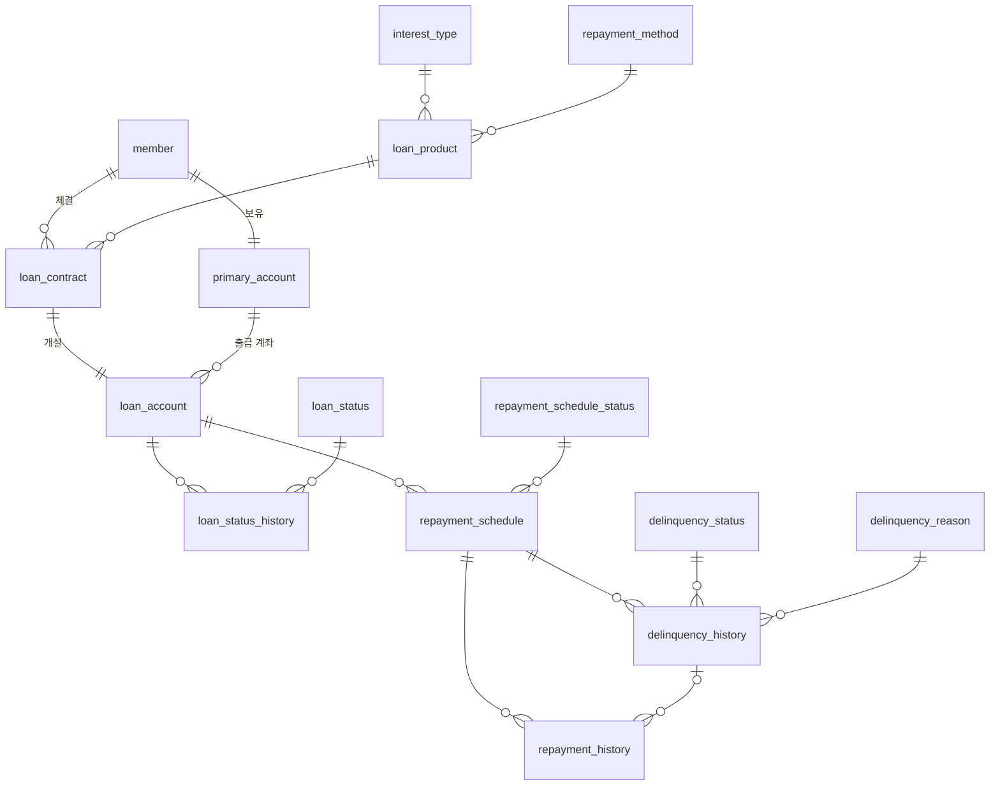

# ERD

스키마의 정본은 `src/main/resources/db/migration/`의 Flyway 마이그레이션이다.
컬럼 상세는 [table_definition.md](./reference/table_definition.md), 원본 DDL은 [ddl.sql](./reference/ddl.sql)을 참고한다.

## 테이블 목록

| No. | 테이블 | 한글명 | 도메인 패키지 | 구분 |
|---|---|---|---|---|
| 1 | `interest_type` | 이자종류 | `product` | 코드성 |
| 2 | `repayment_method` | 상환방법 | `product` | 코드성 |
| 3 | `loan_status` | 대출상태 | `loan` | 코드성 |
| 4 | `repayment_schedule_status` | 상환스케줄상태 | `repayment` | 코드성 |
| 5 | `delinquency_status` | 연체상태 | `repayment` | 코드성 |
| 6 | `delinquency_reason` | 연체근거 | `repayment` | 코드성 |
| 7 | `member` | 회원 | `customer` | 핵심 |
| 8 | `primary_account` | 주 계좌 | `customer` | 핵심 |
| 9 | `loan_product` | 대출상품 | `product` | 핵심 |
| 10 | `loan_contract` | 대출계약 | `loan` | 운영 |
| 11 | `loan_account` | 대출계좌 | `loan` | 운영 |
| 12 | `loan_status_history` | 대출상태 이력 | `loan` | 운영 |
| 13 | `repayment_schedule` | 상환 스케줄 | `repayment` | 상환 |
| 14 | `repayment_history` | 상환 이력 | `repayment` | 상환 |
| 15 | `delinquency_history` | 연체 이력 | `repayment` | 상환 |

- 코드성 테이블의 id는 enum과 1:1로 대응한다. 초기 데이터는 `V1__code_table_data.sql`에 있다.
- Spring Batch 메타 테이블(`BATCH_*` 9개)은 `V2__spring_batch_schema.sql`이 만든다.

## 관계

